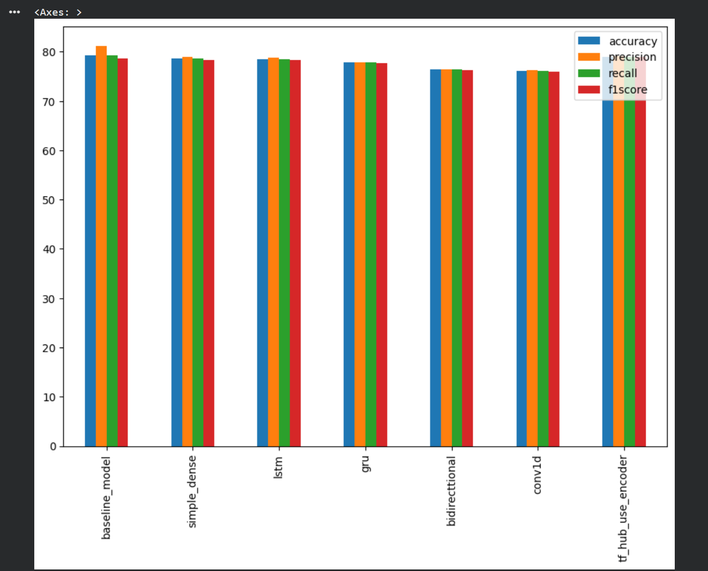

# Disaster-Tweet-Classification-NLP

# 🌪️ Disaster Tweet Classification using NLP

## 📊 Model Performance Comparison



## 📌 Overview

This project aims to classify tweets as **real disaster-related tweets** or **non-disaster tweets** using Natural Language Processing (NLP) and Machine Learning techniques.

Social media platforms like Twitter are often used to report disasters in real time. However, not every tweet containing words such as "fire", "flood", or "explosion" refers to an actual disaster. This project builds a text classification model capable of distinguishing between genuine disaster reports and unrelated tweets.

---

## 🚀 Features

* Text preprocessing and cleaning
* Tokenization and stopword removal
* Feature extraction using TF-IDF
* Binary text classification
* Model evaluation using accuracy and F1-score
* Predicts whether a tweet is disaster-related or not

---

## 📂 Dataset

The dataset contains tweets labeled as:

* **1** → Real Disaster Tweet
* **0** → Not a Disaster Tweet

Dataset Source: Kaggle's *Natural Language Processing with Disaster Tweets* competition.

---

## 🛠️ Technologies Used

* Python
* Pandas
* NumPy
* Matplotlib
* Seaborn
* NLTK
* Scikit-learn
* Jupyter Notebook

---

## 🔍 Workflow

1. Data Loading
2. Data Cleaning
3. Text Preprocessing

   * Lowercasing
   * Removing URLs
   * Removing Punctuation
   * Stopword Removal
   * Stemming/Lemmatization
4. Feature Extraction using TF-IDF
5. Model Training
6. Model Evaluation
7. Prediction on New Tweets

---

## 📊 Results

The model was evaluated using standard classification metrics:

* Accuracy Score
* Precision
* Recall
* F1-Score
* Confusion Matrix

The trained model successfully distinguishes disaster-related tweets from normal tweets with strong performance.


## 💻 Installation

```bash
git clone https://github.com/your-username/Disaster-Tweet-Classification.git

cd Disaster-Tweet-Classification

pip install -r requirements.txt
```


## 📈 Example Predictions

| Tweet                                             | Prediction   |
| ------------------------------------------------- | ------------ |
| Earthquake destroys several buildings in the city | Disaster     |
| I am on fire with my new gaming setup 🔥          | Not Disaster |
| Flood warning issued for nearby areas             | Disaster     |
| This movie was an absolute blast                  | Not Disaster |


## 👨‍💻 Author

**Vishal Chaudhary**

* B.Tech Information Technology, NSUT
* Interested in AI, Machine Learning, Deep Learning, and Computer Vision

If you found this project useful, feel free to ⭐ the repository.
